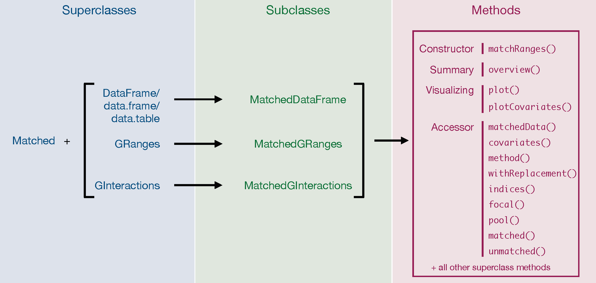

## Introduction

When performing statistical analysis on any set of genomic ranges it
is often important to compare focal sets to null sets that are
carefully matched for possible covariates that may influence the
analysis. To address this need, the `nullranges` package implements
`matchRanges()`, an efficient and convenient tool for selecting a
covariate-matched set of null hypothesis ranges from a pool of
background ranges within the Bioconductor framework. 

In this vignette, we provide an overview of `matchRanges()` and its
associated functions. We start with a simulated example generated with
the utility function `makeExampleMatchedDataSet()`. We also provide an
overview of the class struture and a guide for choosing among the
supported matching methods. To see `matchRanges()` used in real
biological examples, visit
the [Case study I: CTCF occupancy](matching_granges.html),
and [Case study II: CTCF orientation](matching_ginteractions.html)
vignettes.

For a description of the method, see @matchRanges.

```{r, message=FALSE, warning=FALSE, echo=FALSE, fig.width=8.5, fig.height=6.5}

## Make grid of coordinates
makeCoords <- function(npts) {
  coords <- expand.grid(seq(1, 0, length.out = sqrt(npts)),
                        seq(0, 1, length.out = sqrt(npts)))[1:npts,]
  colnames(coords) <- c("y", "x")
  
  coords
}

## Define colors
colors <- c("#e19995", "#adaf64", "#4fbe9b", "#6eb3d9", "#d098d7")

## Create data.frame for points
set.seed(5)
df <- data.frame(color = factor(c(sample(colors, 16, replace = TRUE),
                                sample(colors, 120, replace = TRUE))),
                 size = c(abs(rnorm(16, 0.5, 0.25))+0.35,
                          abs(rnorm(120, 0.5, 0.25))+0.35),
                 set = c(rep('focal', 16),
                         rep('pool', 120)))

## Reorder factor level by colors
levels(df$color) <- colors

## Define focal and pool groups
focal <- df[df$set == 'focal',]
pool <- df[df$set != 'focal',]

## Sort by color
focal <- focal[order(focal$color, -focal$size),]

## Match ranges
library(nullranges)
set.seed(123)
x <- matchRanges(focal = focal,
                 pool = pool,
                 covar = ~color+size,
                 method = 'n', replace = TRUE)

## Sort by color
x <- x[order(x$color, -x$size),]

## Generate point grobs
library(grid)

## Focal set (sorted)
coords <- makeCoords(nrow(focal))
focalSet <- pointsGrob(x = unit(coords$x, 'native'),
                       y = unit(coords$y, 'native'),
                       pch = 21,
                       size = unit(focal$size, "char"),
                       gp = gpar(fill = as.character(focal$color), col = NA))

## Pool set (sorted)
coords <- makeCoords(nrow(pool))
poolSet <- pointsGrob(x = unit(coords$x, 'native'),
                      y = unit(coords$y, 'native'),
                      pch = 21,
                      size = unit(pool$size, "char"),
                      gp = gpar(fill = as.character(pool$color), col = NA))


## Matched set (sorted)
coords <- makeCoords(nrow(x))
matchedSet <- pointsGrob(x = unit(coords$x, 'native'),
                         y = unit(coords$y, 'native'),
                         pch = 21,
                         size = unit(x$size, "char"),
                         gp = gpar(fill = as.character(x$color), col = NA))


## Visualize sets
library(plotgardener)
pageCreate(width = 8.5, height = 6.5, showGuides = FALSE, xgrid = 0, ygrid =0)

## Pool set
plotGG(plot = poolSet, x = 1, y = 1, width = 2.5, height = 2.5)
plotText(label = "Pool Set",
            x = 2.25, y = 0.75,
            just = c("center", "bottom"),
            fontcolor = "#33A02C",
            fontface = "bold")

## Focal set
plotGG(plot = focalSet,
          x = 5.75, y = 1,
          width = (5/6)-(1/8),
          height = (5/6)-(1/8))
plotText(label = "Focal Set",
            x = 5.75 + ((5/6)-(1/8))/2,
            y = 0.75,
            just = c("center", "bottom"),
            fontcolor = "#1F78B4",
            fontface = "bold")

## Matched set
plotGG(plot = matchedSet,
          x = 5.75, y = 2.5,
          width = (5/6)-(1/8),
          height = (5/6)-(1/8))
plotText(label = "Matched Set",
            x = 5.75 + ((5/6)-(1/8))/2,
            y = 2.25,
            just = c("center", "bottom"),
            fontcolor = "#A6CEE3",
            fontface = "bold")

## Arrow and matchRanges label
plotSegments(x0 = 3.75, y0 = 2.5 + ((5/6)-(1/8))/2,
                x1 = 5.40, y1 = 2.5 + ((5/6)-(1/8))/2,
                arrow = arrow(type = "closed", length = unit(0.1, "inches")),
                fill = "black", lwd = 2)
plotText(label = "matchRanges()", fontfamily = 'mono',
            x = 4.625, y = 2.4 + ((5/6)-(1/8))/2,
            just = c("center", "bottom"))

## Matching plots
library(ggplot2)
smallText <- theme(legend.title = element_text(size=8),
                   legend.text=element_text(size=8),
                   title = element_text(size=8),
                   axis.title.x = element_text(size=8),
                   axis.title.y = element_text(size=8))

plot1 <-
  plotPropensity(x, sets=c('f','m','p')) +
  smallText +
  theme(legend.key.size = unit(0.5, 'lines'),
        title = element_blank())

plot2 <-
  plotCovariate(x=x, covar=covariates(x)[1], sets=c('f','m','p')) +
  smallText +
  theme(legend.text = element_blank(),
        legend.position = 'none')

plot3 <-
  plotCovariate(x=x, covar=covariates(x)[2], sets=c('f','m','p'))+
  smallText + 
  theme(legend.key.size = unit(0.5, 'lines'))


## Propensity scores
plotText(label = "plotPropensity()",
            x = 1.0, y = 4.24,
            just = c("left", "bottom"),
            fontface = "bold",
            fontfamily = 'mono')
plotText(label = "~color + size",
            x = 1.15, y = 4.5,
            just = c("left", "bottom"),
            fontsize = 10,
            fontfamily = "mono")
plotGG(plot = plot1,
          x = 0.9, y = 4.5, width = 2.5, height = 1.5,
          just = c("left", "top"))

## Covariate balance
plotText(label = "plotCovariate()",
            x = 3.65, y = 4.24,
            just = c("left", "bottom"),
            fontface = "bold",
            fontfamily = "mono")
plotText(label = covariates(x),
            x = c(3.9, 5.8), y = 4.5,
            just = c("left", "bottom"),
            fontsize = 10,
            fontfamily = "mono")
plotGG(plot = plot2,
          x = 3.40, y = 4.5, width = 1.8, height = 1.5,
          just = c("left", "top"))

plotGG(plot = plot3,
          x = 5.20, y = 4.5, width = 2.75, height = 1.5,
          just = c("left", "top"))
```

## Terminology

`matchRanges` references four sets of data: `focal`, `pool`, `matched`
and `unmatched`. The `focal` set contains the outcome of interest (`Y=1`)
while the `pool` set contains all other observations (`Y=0`).
`matchRanges` generates the `matched` set, which is a subset of the
`pool` that is matched for provided covariates (i.e. `covar`) but
does not contain the outcome of interest (i.e `Y=0`). Finally, the
`unmatched` set contains the remaining unselected elements from
the `pool`. The diagram below depicts the relationships between
the four sets.


## Methodology

`matchRanges` uses 
[propensity scores](https://en.wikipedia.org/wiki/Propensity_score_matching)
to perform subset selection on the `pool` set such that the resulting `matched`
set contains similar distributions of covariates to that of the `focal` set.
A propensity score is the conditional probability of assigning an element
(in our case, a genomic range) to a particular outcome (`Y`) given a set of
covariates. Propensity scores are estimated using a logistic regression model
where the outcome `Y=1` for `focal` and `Y=0` for `pool`, over the provided 
covariates `covar`. The resulting propensity scores are used to select matches
using one of three available matching options: "nearest", "rejection", or
"stratified" with or without replacement. For more information see the section
on [Choosing the method parameter](#choosing_method) below.

## Using `matchRanges()`

We will use a simulated data set to demonstrate matching across covarying features:

```{r, message=FALSE, warning=FALSE}
library(nullranges)
set.seed(123)
x <- makeExampleMatchedDataSet(type = 'GRanges')
x
```

Our simulated dataset has 3 features: logical `feature1`, numeric
`feature2`, and character/factor `feature3`. We can use
`matchRanges()` to compare ranges where `feature1` is `TRUE` to ranges
where `feature1` is `FALSE`, matched by `feature2` and/or `feature3`: 

```{r}
set.seed(123)
mgr <- matchRanges(focal = x[x$feature1],
                   pool = x[!x$feature1],
                   covar = ~feature2 + feature3)
mgr
```

The resulting `MatchedGRanges` object is a set of null hypothesis
ranges selected from our `pool` of options that is the same length as
our input `focal` ranges and matched for `covar` features 2
and 3. These matched ranges print and behave just as normal `GRanges`
would: 

```{r, message=FALSE, warning=FALSE}
library(GenomicRanges)
sort(mgr)
```

We can change the `type` argument of `makeExampleMatchedDataSet` to
input data.frames, data.tables, DataFrames, GRanges and GInteractions
objects - all of which work as inputs for `matchRanges`. These produce
either `MatchedDataFrame`, `MatchedGRanges`, or `MatchedGInteractions`
objects. For more information about the `Matched` class structure and
available methods, see the [Class structure] section below or the help
documentation for each class, `?MatchedDataFrame`, `?MatchedGRanges`,
or `?MatchedGInteractions`. 

`matchRanges()` uses
[propensity scores](https://en.wikipedia.org/wiki/Propensity_score_matching) to
select matches using one of three available matching options:
"nearest", "rejection", or "stratified" with or without
replacement. For more information see the section on 
[Choosing the method parameter](#choosing_method) below.

### Assessing quality of matching

We can assess the quality of `Matched` classes with `overview()`,
`plotCovariate()`, and `plotPropensity()`. `overview()` provides a
quick assessment of overall matching quality by reporting the mean and
standard deviation for covariates and propensity scores of the focal,
pool, matched, and unmatched sets. For factor, character, or logical
covariates (e.g. categorical covariates) the N per set (frequency) is
returned. It also reports the mean difference in focal-matched sets: 

```{r paged.print=FALSE}
overview(mgr)
```

Visualizing propensity scores can show how well sets were matched overall:

```{r}
plotPropensity(mgr)
```

The distributions of features can be visualized in each set with `plotCovariate()`:

```{r}
plotCovariate(mgr)
```

Since these functions return ggplots, `patchwork` can be used to visualize all covariates like this:

```{r, message=FALSE, warning=FALSE, fig.height=6, fig.width=5}
library(patchwork)
plots <- lapply(covariates(mgr), plotCovariate, x=mgr, sets = c('f', 'm', 'p'))
Reduce('/', plots)
```

By default, continuous features are plotted as density line plots
while categorical features are plotted as stacked bar plots. All sets
are also shown by default. Defaults can be overridden by setting the
`type` and `sets` arguments. 

Results from `matchRanges` can also be used in conjunction with `cobalt`
for assessing covariate balance. We recommend using `cobalt` to calculate
and report summary statistics to indicate adequately matched sets.
For more detail on assessing covariate balance, refer to the detailed
documentation on this topic in the `cobalt` vignette:
`vignette("cobalt", package = "cobalt")`. For an example on how to use
`cobalt` with `matchRanges` see 
[Using `cobalt` to assess balancing](#using_cobalt).

### Accessing matched data

Custom plots can be made by extracting data from the `Matched` object:

```{r}
matchedData(mgr)
```

Attributes of the `Matched` object can be extracted with the following accessor functions:

```{r, results='hold'}
covariates(mgr)
method(mgr)
withReplacement(mgr)
```

Each set can also be extracted with the following accessor functions:

```{r, results='hold'}
summary(focal(mgr))
summary(pool(mgr))
summary(matched(mgr))
summary(unmatched(mgr))
```

A "tidy" version of key sets can be obtained using *plyranges* and the
`bind_ranges` function. This enables efficient comparisons across sets
with other *plyranges* functionality (`group_by`, `summarize`, etc.).

```{r message=FALSE}
library(plyranges)
bind_ranges(
  focal = focal(mgr),
  pool = pool(mgr),
  matched = matched(mgr), .id="type"
)
```

The `indices()` function can be used to find the original indices for
each set. For example, `indices(x, set="matched")` will supply the
indices from the `pool` set that corresponds to the `matched` set. In
fact, `matched(x)` is a convenient wrapper around `pool(x)[indices(x,
set='matched')`: 

```{r}
identical(matched(mgr), pool(mgr)[indices(mgr, set = 'matched')])
```

### Using `cobalt` to assess balancing <a id="using_cobalt" />

This is straight-forward by accessing the data with `matchedData(x)`:

```{r}
library(cobalt)
res <- bal.tab(f.build("set", covariates(mgr)),
               data = matchedData(mgr),
               distance = "ps", # name of column containing propensity score
               focal = "focal", # name of focal group in set column
               which.treat = "focal", # compare everything to focal
               s.d.denom = "all") # how to adjust standard deviation

res
love.plot(res)
```


## Choosing the `method` parameter <a id="choosing_method" />

There are currently 3 available methods for selecting a matched set:

1.  Nearest-neighbor matching with replacement

2.  Rejection sampling with/without replacement

3.  Stratified sampling with/without replacement

Currently, nearest-neighbor matching without replacement is not
implemented, but stratified sampling without replacement is a suitable
substitute. 

### Nearest-neighbor matching

Attempts to find the nearest neighbor for each range by using a
rolling-join (as implemented in the `data.table` package) between
`focal` and `pool` propensity scores. 

```{r}
set.seed(123)
mgr <- matchRanges(focal = x[x$feature1],
                   pool = x[!x$feature1],
                   covar = ~feature2 + feature3,
                   method = 'nearest',
                   replace = TRUE)
nn <- overview(mgr)
plotPropensity(mgr)
```

This method is best if you have a very large dataset because it is
usually the fastest matching method. However, because sampling is done
with replacement the user should be careful to assess the number of
duplicate ranges pulled. This can be done using the `indices()`
function: 

```{r, results='hold'}
## Total number of duplicated indices
length(which(duplicated(indices(mgr))))

sum(table(indices(mgr)) > 1) # used more than once
sum(table(indices(mgr)) > 2) # used more than twice
sum(table(indices(mgr)) > 3) # used more than thrice
```

Duplicate ranges can be pulled since this method selects the closest
matching propensity-score in the focal set to each range in the pool
set. It is important to inspect the duplicates when using this method
particularly when there are very few well-matching options to select
from in your pool set to ensure your matched set has a diverse set of
ranges. 

Nearest neighbor matching without replacement is not currently
supported due to its computational complexity. However, stratified
sampling without replacement is an acceptable alternative. 

### Rejection sampling

Uses a probability-based approach to select options in the `pool` that
distributionally match the `focal` set based on propensity scores. The
rejection sampling method first generates kernal-density estimates for
both the focal and pool sets. Then a scale factor is determined by
finding the point at which the difference in focal and pool densities
is maximized. This scale factor is then applied such that the pool
distribution covers the focal distribution at all points. Random
sampling is then conducted, with probability of accepting a pool range
into the matched set given by the ratio between the height of the
density and the scaled (covering) density. 
If `method` or `replace` is not supplied, the default values are 
rejection sampling without replacement. 

```{r}
set.seed(123)
mgr <- matchRanges(focal = x[x$feature1],
                   pool = x[!x$feature1],
                   covar = ~feature2 + feature3,
                   method = 'rejection',
                   replace = FALSE)
rs <- overview(mgr)
plotPropensity(mgr)
```

Rejection sampling is the fastest available matching method for
sampling without replacement. Therefore, it is ideal to use on large
datasets when sampling without replacement is important. However, this
method can be unstable, particularly when the pool set is not much
larger than the focal set. In those cases, the best method to use is
stratified sampling. 

### Stratified sampling

Performs iterative sampling on increasingly large bins of
data. `focal` and `pool` propensity scores are binned by their value
with high granularity, options are randomly selected (with or without
replacement) within each bin and subsequently removed from the pool of
available options. This procedure is repeated, decreasing the number
of bins (and increasing bin size) until the number of selected matches
is equal to the focal set. While matches are being found in each bin
the bins stay small. However, as the number of bins with no matches
increases the algorithm expands bin size faster, which maintains
matching quality while decreasing run-time. 

```{r}
set.seed(123)
mgr <- matchRanges(focal = x[x$feature1],
                   pool = x[!x$feature1],
                   covar = ~feature2 + feature3,
                   method = 'stratified',
                   replace = FALSE)
ss <- overview(mgr)
plotPropensity(mgr)
```

For very large data sets, users might notice a slight increase in run
time compared to the other methods. Stratified sampling tends to work
very well for discrete data, and often produces the best matches even
on continuous data: 

```{r}
## Extract difference in propensity scores
## between focal and matched sets
fmps <- sapply(c(nn, rs, ss), `[[`, "quality")
c('nearest', 'rejection', 'stratified')[which.min(fmps)]

```

## Class structure

Since `matchRanges()` automatically constructs the relevant classes,
this section is not essential for using any of the `nullranges`
package functionality. Instead, this section serves as a guide for
developers who wish to extend these classes or those more interested
in S4 implementation details. 

### Implementation details

`matchRanges()` acts as a constructor, combining a `Matched`
superclass - which contains the matching results - with either a
`DataFrame`(`data.frame`/`data.table`), `GRanges`, or `GInteractions`
superclass. This results in the `MatchedDataFrame`, `MatchedGRanges`,
or `MatchedGInteractions` subclasses. 



Internally, each `Matched` subclass uses a "delegate" object of the
same type to assign its slots. The delegate object used is the
`matched` set. Therefore, the resulting `Matched*` object behaves as a
combination of both its superclasses - with access to methods from
both. 

For example, using `matchRanges()` on `GRanges` objects assigns a
`GRanges` delegate object which is used to populate GRanges-specific
slots. This results in a `MatchedGRanges` object, with access to both
`Matched` functions (e.g. `plotCovariate`) as well as normal `GRanges`
methods (e.g.s `seqnames`, `resize`, etc...). 

# Session information

```{r}
sessionInfo()
```
# References

