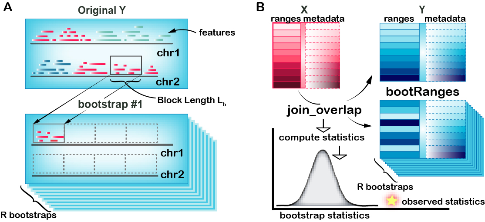

# Introduction

```{r setup, include=FALSE}
knitr::opts_chunk$set(fig.width=5, fig.height=5)
```

The following vignette describes the *nullranges* implementation of the
block bootstrap with respect to a genomic segmentation. See the main
nullranges vignette for an overview of the idea of bootstrapping, or
below diagram, and there is additionally a vignette on block
boostrapping without respect to segmentation-[Unsegmented block
bootstrap](unseg_boot_ranges.html).

As proposed by @bickel_2010, *nullranges* contains an implementation of
a block bootstrap, such that features are sampled from the genome in
blocks. The original block bootstrapping algorithm is implemented in a
python software called Genome Structure Correlation,
[GSC](https://github.com/ParkerLab/encodegsc).

In a segmented block bootstrap, the blocks are sampled and placed within
regions of a genome *segmentation*. That is, for a genome segmented into
states 1,2,...,S, blocks from state *s* will be used to tile the ranges
of state *s* in each bootstrap sample. The process can be visualized in
(A), a block with length $L_b$ is randomly selected from state "red" and
move to a tile block across chromosome. Additionally, the workflow of
bootRanges is diagrammed in (B) and listed as:

1.  Overlap *GRanges* of feature $x$ and *GRanges* of feature $y$ to
    derive interested observed statistics
2.  `bootRanges()` with optional `segmentation` and `exclude` creates a
    *bootRanges* object $y'$
3.  Overlap *GRanges* of feature $x$ and $y'$ to derive interested
    bootstrap statistics
4.  $z$ test is performed for testing the null hypothesis that there is
    no true biological enrichment

```{r, echo=FALSE}

```

The segmented block bootstrap has two options, either:

-   Perform a de-novo segmentation of the genome using feature density,
    e.g. gene density
-   Use exiting segmentation (e.g. ChromHMM, etc.) downloaded from
    AnnotationHub or external to Bioconductor (BED files imported with
    *rtracklayer*)

In this vignette, we give an example of segmenting the hg38 genome by
Ensembl gene density, create bootstrapped peaks and evaluate overlaps
for observed peaks and bootstrap peaks, then we profile the time to
generate a single block bootstrap sample. Finally, we use a toy dataset
to visualize what a segmented block bootstrap sample looks like with
respect to a genome segmentation.

A finally consideration is whether the blocks should scale
proportionally to the segment state length, with the default setting of
`proportionLength=TRUE`. When blocks scale proportionally, `blockLength`
provides the maximal length of a block, while the actual block length
used for a segmentation state is proportional to the fraction of genomic
basepairs covered by that state. This option is visualized on toy data
at the end of this vignette.

# Pre-built segmentations

*nullranges* has generated pre-built segmentations for easy use by
following below section [Segmentation by gene
density](#Segmentation%20by%20gene%20density). Either pre-built
segmentations using *CBS* or *HMM* methods considering excludable
regions can be selected from *ExperimentHub*.

```{r}
suppressPackageStartupMessages(library(ExperimentHub))
eh = ExperimentHub()
# query(eh, "nullrangesdata")
seg_cbs <- eh[["EH7307"]]
seg_hmm <- eh[["EH7308"]]
seg <- seg_cbs
```

# Segmentation by gene density

First we obtain the Ensembl genes [@ensembl2021] for segmenting by gene
density. We obtain these using the *ensembldb* package [@ensembldb].

```{r}
suppressPackageStartupMessages(library(ensembldb))
suppressPackageStartupMessages(library(EnsDb.Hsapiens.v86))
edb <- EnsDb.Hsapiens.v86
filt <- AnnotationFilterList(GeneIdFilter("ENSG", "startsWith"))
g <- genes(edb, filter = filt)
```

We perform some processing to align the sequences (chromosomes) of `g`
with our excluded regions and our features of interest (DNase
hypersensitive sites, or DHS, defined below).

```{r}
library(GenomeInfoDb)
g <- keepStandardChromosomes(g, pruning.mode = "coarse")
seqlevels(g, pruning.mode="coarse") <- setdiff(seqlevels(g), "MT")
# normally we would assign a new style, but for recent host issues
## seqlevelsStyle(g) <- "UCSC" 
seqlevels(g) <- paste0("chr", seqlevels(g))
genome(g) <- "hg38"
g <- sortSeqlevels(g)
g <- sort(g)
table(seqnames(g))
```

## Import excluded regions

We next import excluded regions including ENCODE-produced excludable
regions[@encode_exclude], telomeres from UCSC, centromeres [@rCGH]. For
easy use, pre-combined excludable regions is stored in *ExperimentHub.*
These steps using *excluderanges* package [@excluderanges] are included
in *nullrangesData* in the `inst/scripts/make-segmentation-hg38.R`
script.

```{r}
# suppressPackageStartupMessages(library(AnnotationHub))
exclude <- eh[["EH7306"]]
all(seqlengths(g) == seqlengths(exclude))
```

## CBS segmentation

We first demonstrate the use a CBS segmentation as implemented in
*DNAcopy* [@dnacopy].

We load the *nullranges* and *plyranges* packages, and *patchwork* in
order to produce grids of plots.

```{r}
library(nullranges)
suppressPackageStartupMessages(library(plyranges))
library(patchwork)
```

We subset the excluded ranges to those which are 500 bp or larger. The
motivation for this step is to avoid segmenting the genome into many
small pieces due to an abundance of short excluded regions. Note that we
re-save the excluded ranges to `exclude`.

Here, and below, we need to specify `plyranges::filter` as it conflicts
with `filter` exported by *ensembldb*.

```{r seg-cbs}
set.seed(5)
exclude <- exclude %>%
  plyranges::filter(width(exclude) >= 500)
L_s <- 1e6
seg_cbs <- segmentDensity(g, n = 3, L_s = L_s,
                          exclude = exclude, type = "cbs")
plots <- lapply(c("ranges","barplot","boxplot"), function(t) {
  plotSegment(seg_cbs, exclude, type = t)
})
plots[[1]]
plots[[2]] + plots[[3]]
```

Note here, the default *ranges* plot gives whole genome and every
fractured bind regions represents state transformations happens.
However, some transformations within small ranges cannot be visualized,
e.g 1kb. If user want to look into specific ranges of segmentation
state, the *region* argument is flexible to support.

```{r}
region <- GRanges("chr16", IRanges(3e7,4e7))
plotSegment(seg_cbs, exclude, type="ranges", region=region)
```

## Alternatively: HMM segmentation

Here we use an alternative segmentation implemented in the *RcppHMM*
CRAN package, using the `initGHMM`, `learnEM`, and `viterbi` functions.

```{r seg-hmm}
seg_hmm <- segmentDensity(g, n = 3, L_s = L_s,
                          exclude = exclude, type = "hmm")
plots <- lapply(c("ranges","barplot","boxplot"), function(t) {
  plotSegment(seg_hmm, exclude, type = t)
})
plots[[1]]
plots[[2]] + plots[[3]]
```

# Segmented block bootstrap

We use a set of DNase hypersensitivity sites (DHS) from the ENCODE
project [@encode] in A549 cell line (ENCSR614GWM). Here, for speed, we
work with a pre-processed data object from ExperimentHub, created using
the following steps:

-   Download ENCODE DNase hypersensitive peaks in A549 from
    *AnnotationHub*
-   Subset to standard chromosomes and remove mitochondrial DNA
-   Use a chain file from UCSC to lift ranges from hg19 to hg38
-   Sort the DHS features to be bootstrapped

These steps are included in *nullrangesData* in the
`inst/scripts/make-dhs-data.R` script.

For speed of the vignette, we restrict to a smaller number of DHS,
filtering by the signal value. We also remove metadata columns that we
don't need for the bootstrap analysis. Consider, when creating
bootstrapped data, that you will be creating an object many times larger
than your original features, so filtering and trimming extra metadata
can help make the analysis more efficient.

```{r}
suppressPackageStartupMessages(library(nullrangesData))
dhs <- DHSA549Hg38()
dhs <- dhs %>% plyranges::filter(signalValue > 100) %>%
  mutate(id = seq_along(.)) %>%
  plyranges::select(id)
length(dhs)
table(seqnames(dhs))
```

Now we apply a segmented block bootstrap with blocks of size 500kb, to
the peaks. Here we show generation of 50 iterations of a block bootstrap
followed by a typical overlap analysis using *plyranges* [@Lee2019]. (We
might normally do 100 iterations or more, depending on the granularity
of the bootstrap distribution that is needed.)

```{r}
set.seed(5) # for reproducibility
R <- 50
blockLength <- 5e5
boots <- bootRanges(dhs, blockLength, R = R, seg = seg, exclude=exclude)
boots
```

What is returned here? The `bootRanges` function returns a *bootRanges*
object, which is a simple sub-class of *GRanges*. The iteration (`iter`)
and the block length (`blockLength`) are recorded as metadata columns,
accessible via `mcols`. We return the bootstrapped ranges as *GRanges*
rather than *GRangesList*, as the former is more compatible with
downstream overlap joins with *plyranges*, where the iteration column
can be used with `group_by` to provide per bootstrap summary statistics,
as shown below.

Note that we use the `exclude` object from the previous step, which does
not contain small ranges. If one wanted to also avoid generation of
bootstrapped features that overlap small excluded ranges, then omit this
filtering step (use the original, complete `exclude` feature set).

We can examine the number and extent of the bootstrapped data:

```{r}
boots %>% group_by(iter) %>%
  summarize(
    n = n(),
    total_width = sum(width)
  )
```

which is similar to the orig inal set, after filtering out those
overlapping the excluded region:

```{r}
dhs_filt <- dhs %>% filter_by_non_overlaps(exclude)
dhs_filt %>% summarize(n = n(), total_width=sum(width))
```

# Use with *plyranges*

Suppose we have a set of features `x` and we are interested in
evaluating the overlap of this set with the DHS. We can calculate for
example the mean observed number of overlaps for features in `x` (or
something more complicated, e.g. the maximum log fold change or signal
value for DHS peaks within a `maxgap` window of `x`).

```{r}
x <- GRanges("chr2", IRanges(1 + 50:99 * 1e6, width=1e6), x_id=1:50)
x <- x %>% mutate(n_overlaps = count_overlaps(., dhs_filt))
mean( x$n_overlaps )
```

We can repeat this with the bootstrapped features using a `group_by`
command, a `summarize`, followed by a second `group_by` and `summarize`.
It may help to step through these commands one by one to understand what
the intermediate output is.

Note that we need to use `tidyr::complete` in order to fill in
combinations of `x` and `iter` where the overlap was 0.

```{r}
suppressPackageStartupMessages(library(tidyr))
```

```{r}
boot_stats <- x %>% join_overlap_inner(boots) %>%
  group_by(x_id, iter) %>%
  summarize(n_overlaps = n()) %>%
  as.data.frame() %>%
  complete(x_id, iter, fill=list(n_overlaps = 0)) %>%
  group_by(iter) %>%
  summarize(meanOverlaps = mean(n_overlaps))
```

The above code, first grouping by `x_id` and `iter`, then subsequently
by `iter` is general and allows for more complex analysis than just mean
overlap (e.g. how many times an `x` range has 1 or more overlap, what is
the mean or max signal value for peaks overlapping ranges in `x`, etc.).

Finally we can plot a histogram. In this case, as the `x` features were
arbitrary, our observed value falls within the distribution of mean
overlap with bootstrapped data.

```{r boot-hist}
suppressPackageStartupMessages(library(ggplot2))
ggplot(boot_stats, aes(meanOverlaps)) +
  geom_histogram(binwidth=.2)
```

For more examples of combining `bootRanges` from *nullranges* with
*plyranges* piped operations, see the relevant chapter in the
[tidy-ranges-tutorial](https://nullranges.github.io/tidy-ranges-tutorial/bootstrap-overlap.html)
book.

# Timing on DHS peaks

Here, we test the speed of the various options for bootstrapping (see
below for visualization of the difference).

```{r}
library(microbenchmark)
microbenchmark(
  list=alist(
    prop = bootRanges(dhs, blockLength, seg = seg, proportionLength = TRUE),
    no_prop = bootRanges(dhs, blockLength, seg = seg, proportionLength = FALSE)
), times=10)
```

# Visualizing toy bootstrap samples

Below we present a toy example for visualizing the segmented block
bootstrap. First, we define a helper function for plotting *GRanges*
using *plotgardener* [@Kramer2021]. A key aspect here is that we color
the original and bootstrapped ranges by the genomic state (the state of
the segmentation that the original ranges fall in).

```{r}
suppressPackageStartupMessages(library(plotgardener))
my_palette <- function(n) {
  head(c("red","green3","red3","dodgerblue",
         "blue2","green4","darkred"), n)
}
plotGRanges <- function(gr) {
  pageCreate(width = 5, height = 5, xgrid = 0,
                ygrid = 0, showGuides = TRUE)
  for (i in seq_along(seqlevels(gr))) {
    chrom <- seqlevels(gr)[i]
    chromend <- seqlengths(gr)[[chrom]]
    suppressMessages({
      p <- pgParams(chromstart = 0, chromend = chromend,
                    x = 0.5, width = 4*chromend/500, height = 2,
                    at = seq(0, chromend, 50),
                    fill = colorby("state_col", palette=my_palette))
      prngs <- plotRanges(data = gr, params = p,
                          chrom = chrom,
                          y = 2 * i,
                          just = c("left", "bottom"))
      annoGenomeLabel(plot = prngs, params = p, y = 0.1 + 2 * i)
    })
  }
}
```

Create a toy genome segmentation:

```{r}
library(GenomicRanges)
seq_nms <- rep(c("chr1","chr2"), c(4,3))
seg <- GRanges(
  seqnames = seq_nms,
  IRanges(start = c(1, 101, 201, 401, 1, 201, 301),
          width = c(100, 100, 200, 100, 200, 100, 100)),
  seqlengths=c(chr1=500,chr2=400),
  state = c(1,2,1,3,3,2,1),
  state_col = factor(1:7)
)
```

We can visualize with our helper function:

```{r toysegments}
plotGRanges(seg)
```

Now create small ranges distributed uniformly across the toy genome:

```{r toyranges}
set.seed(1)
n <- 200
gr <- GRanges(
  seqnames=sort(sample(c("chr1","chr2"), n, TRUE)),
  IRanges(start=round(runif(n, 1, 500-10+1)), width=10)
)
suppressWarnings({
  seqlengths(gr) <- seqlengths(seg)
})
gr <- gr[!(seqnames(gr) == "chr2" & end(gr) > 400)]
gr <- sort(gr)
idx <- findOverlaps(gr, seg, type="within", select="first")
gr <- gr[!is.na(idx)]
idx <- idx[!is.na(idx)]
gr$state <- seg$state[idx]
gr$state_col <- factor(seg$state_col[idx])
plotGRanges(gr)
```

## Not scaling by segmentation

We can visualize block bootstrapped ranges when the blocks do not scale
to segment state length:

```{r toy-no-prop}
set.seed(1)
gr_prime <- bootRanges(gr, blockLength = 25, seg = seg,
                       proportionLength = FALSE)
plotGRanges(gr_prime)
```

## Scaling by segmentation

This time the blocks scale to the segment state length. Note that in
this case `blockLength` is the *maximal* block length possible, but the
actual block lengths per segment will be smaller (proportional to the
fraction of basepairs covered by that state in the genome segmentation).

```{r toy-prop}
set.seed(1)
gr_prime <- bootRanges(gr, blockLength = 50, seg = seg,
                       proportionLength = TRUE)
plotGRanges(gr_prime)
```

Note that some ranges from adjacent states are allowed to be placed
within different states in the bootstrap sample. This is because, during
the random sampling of blocks of original data, a block is allowed to
extend beyond the segmentation region of the state being sampled, and
features from adjacent states are not excluded from the sampled block.

# Session information

```{r}
sessionInfo()
```

# References
